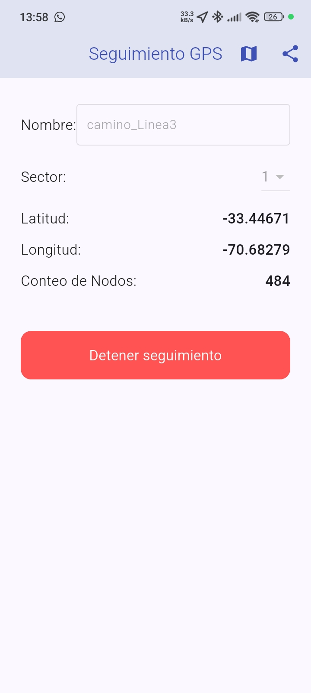
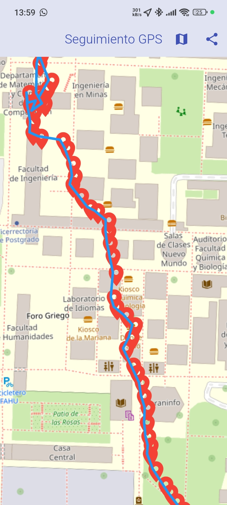
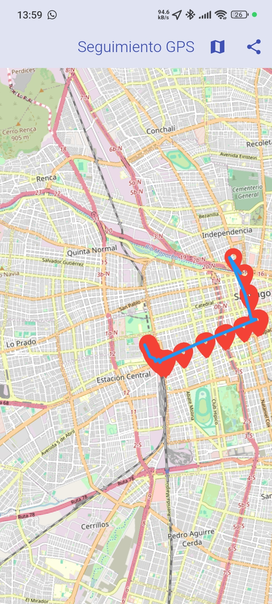

# GPS Tracker con OpenStreetMap

## Descripción 📍

Aplicación Flutter para rastreo GPS que registra coordenadas, las muestra en un mapa interactivo (OpenStreetMap) y permite exportar los datos. Ideal para trabajos de campo, levantamientos topográficos o actividades al aire libre.

## Características principales ✨

- 📍 Registro continuo de coordenadas GPS
- 🗺️ Visualización en mapa OpenStreetMap
- 🏷️ Asignación de nombres y sectores a los registros
- 📊 Contador de nodos en tiempo real
- 📤 Exportación de datos en formato CSV
- 🗑️ Reinicio de datos al iniciar nuevo registro

## Formato de archivo de salida 📄

Los datos se guardan en `gps_nodes.txt` con el siguiente formato por línea:

```
id: [nombre][sector][númeroSecuencial],[nombre],[sector],[latitud],[longitud]
```

Ejemplo:
```
id: Juan11,Juan,1,19.4326077,-99.133208
id: Juan12,Juan,1,19.4326085,-99.133209
```

## Requisitos 📋

- Flutter SDK (versión estable más reciente)
- Paquetes adicionales:
  - flutter_map
  - latlong2
  - geolocator
  - path_provider
  - share_plus

## Instalación ⚙️

1. Clona el repositorio
2. Ejecuta `flutter pub get` para instalar dependencias
3. Para Android, asegúrate de tener los permisos de ubicación configurados

## Uso 🚀

1. **Configuración inicial**:
   - Ingresa un nombre descriptivo
   - Selecciona el sector (1-8)

2. **Rastreo**:
   - Presiona "Iniciar seguimiento" para comenzar
   - Los puntos se registrarán automáticamente
   - Usa el botón del mapa para ver los puntos registrados

3. **Exportación**:
   - Al detener el seguimiento, los datos se guardan automáticamente
   - Usa el botón de compartir para exportar el archivo

## Capturas de pantalla 📸

| Vista principal | Mapa con puntos | Mapa con puntos 2 |
|-----------------|-----------------|-------------------|
|  |  | |

## Estructura del proyecto 🗂️

```
lib/
├── main.dart          # Punto de entrada
├── widgets/           # Componentes personalizados
└── services/          # Lógica de negocio
```

## Personalización 🎨

Puedes modificar:
- Distancia mínima entre puntos (`distanceFilter`)
- Precisión GPS (`LocationAccuracy`)
- Estilo del mapa (editando `TileLayer`)
- Formato de salida (modificando `_saveNodesToFile`)

## Licencia 📜

Este proyecto está bajo licencia MIT. Ver archivo [LICENSE](LICENSE) para más detalles.
